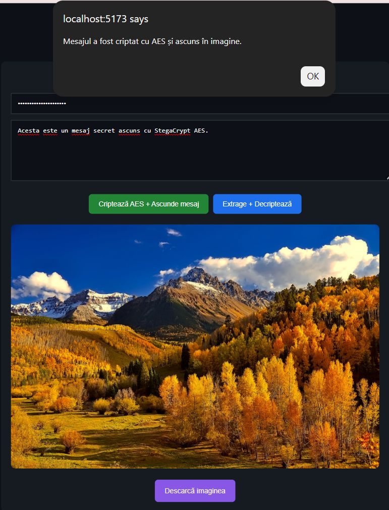
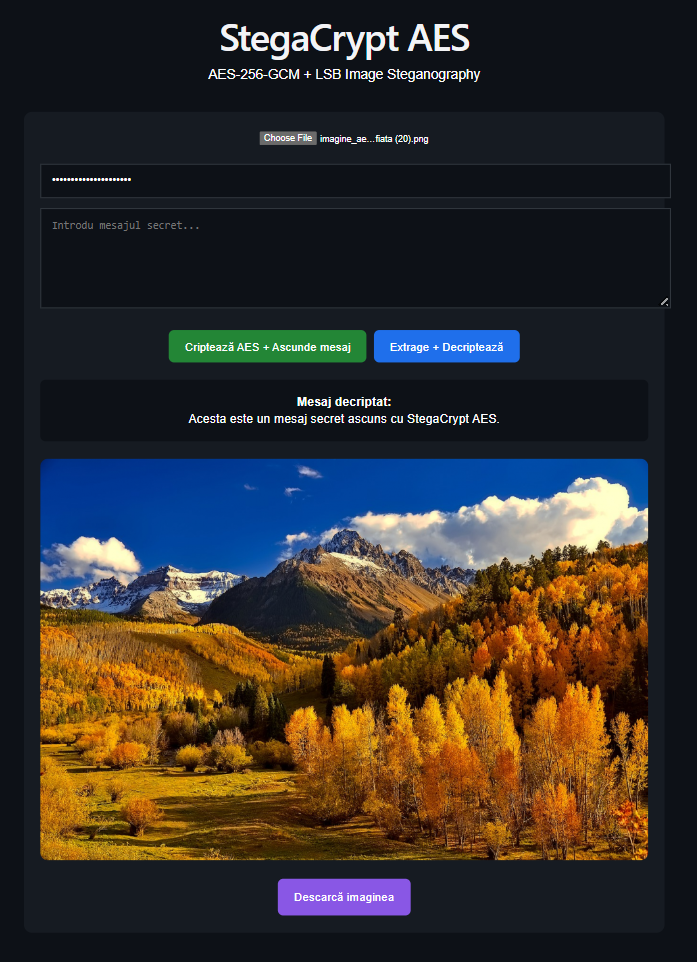

# 🔐 StegaCrypt AES

**Secure Image Steganography with AES-256-GCM Encryption**

StegaCrypt AES is a web application that combines **AES-256-GCM authenticated encryption** with **LSB (Least Significant Bit) image steganography** to securely hide encrypted text messages inside images.

The message is encrypted before being embedded into the image, providing two layers of protection: **cryptography** protects the content, while **steganography** conceals its existence.

---

## 📸 Demo

### Encrypt & Hide



### Extract & Decrypt



---

## ✨ Features

- 🔐 AES-256-GCM authenticated encryption
- 🖼️ LSB image steganography
- 🔑 Password-based encryption
- 📥 Download generated stego images
- 🔎 Extract hidden encrypted data from an image
- 🔓 Decrypt the recovered message using the correct password
- 🌐 Runs directly in the browser
- ⚛️ Built with React and Vite
- 🎨 Simple responsive dark interface

---

## 🔄 How It Works

### Hiding a message

```text
Secret Message
      │
      ▼
AES-256-GCM Encryption
      │
      ▼
Encrypted Payload
      │
      ▼
LSB Steganography
      │
      ▼
Stego Image
```

The user selects an image, enters a secret message and provides a password.

StegaCrypt encrypts the message and then embeds the resulting encrypted payload into the least significant bits of the image pixel data.

### Recovering a message

```text
Stego Image
      │
      ▼
LSB Extraction
      │
      ▼
Encrypted Payload
      │
      ▼
AES-GCM Decryption
      │
      ▼
Original Message
```

The application extracts the hidden payload from the image and attempts to decrypt it using the supplied password.

---

## 🛡️ Security Design

StegaCrypt uses two complementary techniques:

**Cryptography**  
The secret message is encrypted using AES-GCM before it is embedded into the image. AES-GCM provides both confidentiality and authentication, allowing the application to detect incorrect credentials or modified encrypted data.

**Steganography**  
The encrypted payload is embedded using Least Significant Bit manipulation. Small changes are made to image pixel values to encode the hidden information while keeping the visual appearance of the image largely unchanged.

This means that extracting the hidden data alone is not sufficient to recover the original message — the encrypted payload must also be successfully decrypted.

> **Note:** This project was developed for educational and portfolio purposes and should not be considered a replacement for professionally audited cryptographic software.

---

## 🧰 Tech Stack

- **React**
- **JavaScript**
- **Vite**
- **HTML5**
- **CSS3**
- **Web Crypto API**
- **Canvas API**

---

## 🚀 Installation

Clone the repository:

```bash
git clone https://github.com/MeLi-afkl/StegaCrypt-AES.git
```

Enter the project directory:

```bash
cd StegaCrypt-AES
```

Install the dependencies:

```bash
npm install
```

Start the development server:

```bash
npm run dev
```

Then open the local address displayed by Vite in your browser.

---

## 🧪 Usage

### Encrypt and hide a message

1. Select an image.
2. Enter a password.
3. Enter the secret message.
4. Click **Criptează AES + Ascunde mesaj**.
5. Download the generated stego image.

### Extract and decrypt a message

1. Select an image previously generated by StegaCrypt.
2. Enter the same password used during encryption.
3. Click **Extrage + Decriptează**.
4. The original message is extracted and displayed.

---

## 🎯 Project Purpose

StegaCrypt AES was created as a practical exploration of the relationship between **cryptography, information hiding and web technologies**.

The project demonstrates how modern browser APIs can be used to implement an end-to-end workflow combining authenticated encryption with image-based data hiding.

---

## 👩‍💻 Author

Developed by **MeLi-afkl**

---

⭐ If you find this project interesting, feel free to explore the code and experiment with it.